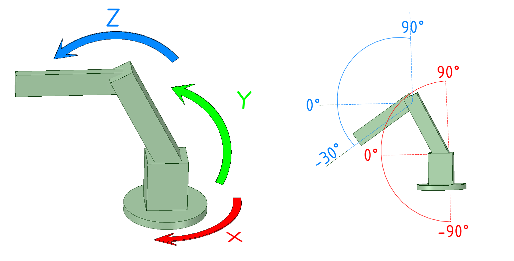
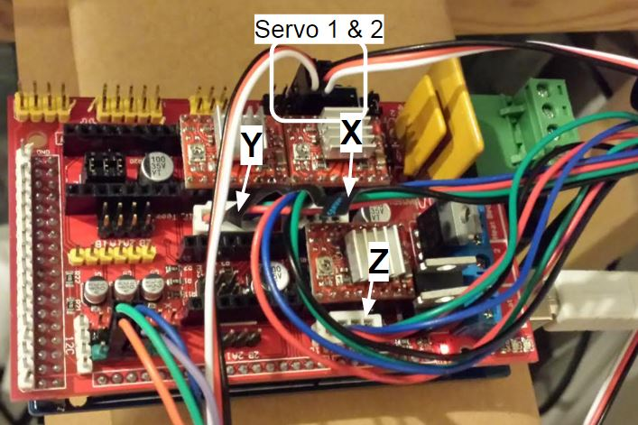

#Armour
##Open source robotic arm control software.
This project was designed to be a replacement for the useless software provided with the Dobot robotic arm, but should work well with any robotic arm that can be modelled using Denavit-Hartenberg parameters.
This is in a very, very early stage, and is only a console app at the moment, allowing control of the arm through the keyboard.

#Firmware
The current implementation uses G-Codes as the protocol for arm control and assumes that your arm is set up for one degree per mm.
I use the repetier firmware which works pretty well but any 3D printer firmware should work.

#Host software
Obviously this software is the host software but it's not the greatest tool to use to test your connections and pin assignments. For that I use the [repetier host](http://www.repetier.com/download-now/).

#Dobot
The dobot is configured with the three axes laid out in the following arangement.

##Wiring the Dobot
I'd recommend using the RAMPS 1.4 driver board as it provides outputs for all functions relating to the arm.

###RAMPS
Here is a picture of the RAMPS board wired up to the Dobot outputs.

To wire up the arm start by putting 3 jumpers across all 3 microstepping switches beneath each controller - this will set controllers to 16 times microstepping.

Then put the A4988 stepper drivers into the slots shown in the image and connect the stepper cables.

You'll need a 5V power supply for the RAMPS board, connected to the green connector in the image above. I used the one that came with the Dobot by chopping the jack off the end and wiring it in.

Also put a jumper across the middle and inner pins next to the servo connectors to power join the VCC to the servo VCC.

###Endstops
For some reason the people who made the Dobot decided not to implement any kind of end stop on the arm. I assume they intended to use the 2 axis angle sensors that are mounted on each segment. I couldn't find any code that would allow me to hook into these sensors so I opted for the simple route and put some physical end stops in.

The switch mounting block can be 3D printed from the stl file in dobot/HomeSwitchBlock.stl

##Configuring the repetier firmware
- Download the [Arduino](https://www.arduino.cc/) IDE if you don't already have it.
- Download the latest version of the [repetier firmware](http://www.repetier.com/documentation/repetier-firmware/).
- Open Repetier/Repetier.ino in Arduino
- Open configuration.h and overwrite it with the contents of dobot/Configuration.h
- Compile and program the arduino mega
- Open Repetier host and confirm that all the arm functions are working. Servos can be adjusted using [M340](http://reprap.org/wiki/Gcode#M340:_Control_the_servos)

# Development
To run this project you'll need visual studio. Set the start up project to "ConsoleArmControl". That is the main entry point at this stage.
Where possible write with TDD.

## Forward kinematics
The forward kinematics uses a series of Denavit-Hartenberg matricies with parameters specified by the arm being controlled. For now this is the Dobot arm parameters but could be any arm.
## Inverse kinematics
The inverse kinematics uses a hill climbing algorithm to identify the correct set of joint variables. With a randomized restart when a local maxima is reached.

This is not the most efficient algorithm but I don't know enough maths to improve it at this point. If someone who understands IK better can write a better algorithm I'll happily merge a pull request.